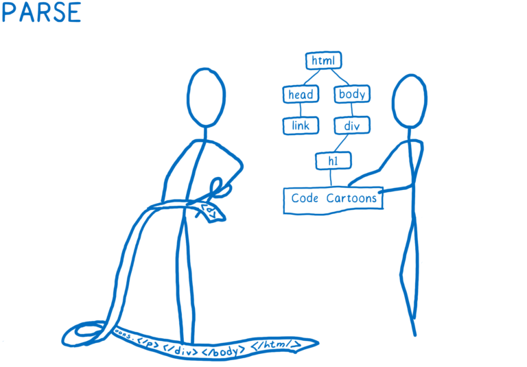
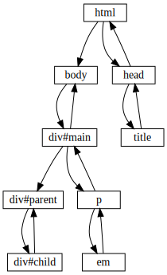

# 只用C/C++内置函数实现的爬虫[WIP]

## 前言

<<Unix网络编程>>这本砖头书读过, 其他的C++书籍, 如<<C++ Primer>>, <<Effective C++>>, <<Modern C++>>也读过, 感觉不把书中的内容实践下, 很容易遗忘, 但是日常的工作内容并不会涉及底层网络服务, 一切底层细节内容都被框架给包掉了, 开发的主力语言是Java, 也不会使用到C++. 因此决定创造个机会实践下这些知识, 最终决定只用C/C++内置函数库写个爬虫.

需要认清的一个事实是, 我并不是需要实现个数据抓取的需求, 为了赶需求, 我大可使用Python/NodeJs/Java实现, 相关库十分齐全, 开发成本非常低. 我的目的是理解底层的操作系统和网络开发技术, 想借此项目提交自己的内功. 所以最终的"需求"是只用C/C++的内置函数, 不借助任何第三方库实现一个爬虫, "目标和成果"是借此锤炼网络技能和C++技能.

注明: 爬虫只是个切入点, 也可以实现其他类型的轮子, 重要的是达到锤炼的效果. 如独孤大侠那般, 不滞于物, 草木竹石皆可为剑

### 技术栈

首先, 在开发一个需求前, 免不了先进行需求分析. 为此, 我先来分析一下爬虫的步骤:

1. 开启一个循环, 和server端建立TCP连接
2. 从URL队列中拿出url, 并准备http请求
3. 将http请求发送到服务端, 等待返回结果
4. 处理http响应, 读取HTML, 解析HTML, 处理HTML, 然后将未处理的url放入URl队列中
5. 保存处理好的数据.
6. 重复第2步

从上文的分析中, 可以初步整理出需要哪些工具和技术栈:

1. 因为需要发送Http请求, 且C/C++并没有内置Http网络相关的库, 需要个类似Java的HttpClient/Python的Requests的组件 (什么, 用`socket`, 总不能每次手动调用`socket`发送Http协议的报文)
2. 因为需要解析HTML, 且C/C+并没有内置Html相关的库, 需要个类似Java的Jsoup/Python的BeautifulSoup的组件 (什么? 你想用正则表达式, [正则表达式解析不了Html的.](https://stackoverflow.com/questions/1732348/regex-match-open-tags-except-xhtml-self-contained-tags))
3. 因为需要保存处理好的数据, ~~所以我需要造个支持ACID的数据库~~, 需要个类似Java的Fastjson的组件, 可以将处理好的数据保存成json文件. (什么? 你想保存成text, 有点追求好不好)
4. 因为需要尽量高效地进行调度, 所以需要个基于事件循环的调度器(应该是个类似名字的东东), 高效地进行`socket`连接的调度. (什么? 你想用循环, 那一次就只能处理一个请求了, 说好的要解决[c10m的决心呢?](http://highscalability.com/blog/2013/5/13/the-secret-to-10-million-concurrent-connections-the-kernel-i.html])
5. 最后还需要篇让人产生共鸣的文档.

## 实现

### Html解析器[完工]

主要的工作就是将html文件解析成DOM树, 然后提供对应的查找方法, 在DOM树上按Id(或者Tag name)查找指定的节点, 查找的方式多种多样, 如xpath, 或者css selector等.

||
|:--:|
|图来自[Quantum css引擎原理介绍](https://hacks.mozilla.org/2017/08/inside-a-super-fast-css-engine-quantum-css-aka-stylo/)|

实际上, Html解析器实际工作的组件应该是两个: 解析器和选择器; 解析器负责将冷冰冰的Html文本解析成内存中充满生命力的DOM Tree; 而选择器就负责按条件查询挂在DOM Tree的节点

### 解析器

Html解析的工作主要是由`html`和`dom`两个文件负责, `html`负责相应的解析工作, `dom`负责承载解析后相应的数据结构(也就是DOM树). `html`解析的策略是从`html`节点开始, 对于成对存在的html tag, 它们本身的结构就是一颗树, 以深度优先搜索(Depth First Search), 直到某个节点没有子节点, 然后返回查找下一个节点. 假设有如下的html数据:

```html
<html>
  <body>
    <div id="main" class="test">
      <div id="parent" class="parent">
        <div id="child" class="child"></div>
      </div>
      <p>Hello <em>world</em>!</p>
    </div>
  </body>
  <head>
      <title>Hi</title>
  </head>
</html>
```

解析的顺序如下图, 因为html tag是成对存在的(如: `<div></div>`), 所以`div#parent->div#child`有④和⑤, 分别代表解析opening tag `<div>`和解析closing tag`</div>`:



上文假设了html tag是成对存在的, 但是事实并非如此, html不像xml那样严格匹配opening-tag和closing-tag的, 会有类似`<input>`或者`<meta>`这样 的self-closing tag. 这相当于是和特殊的节点, 它们不会存在子节点, 所以遇到 self-closing tag节点的时候直接返回. 然后就会引申出另外一个问题, 如何判断某个tag是否是self-closing tag呢? 思虑下来, 解决方案有两个:

1. 通过解析html文件判断; 判断某个节点没有子节点, 并且没有closing tag.
2. 维护一个符号表, 在符号表内的tag就是self-closing tag.

我最后选择的方案是方案2, 因为方案1实现起来并没有想象那么简单, 还要考虑self-closing tag有多种形式, 如: `<input>`或 `<input/>`. 最后解析器实现的是标准html解析器的子集, 支持功能列表如下:

1. 成对的html标签: `<p>...</p>`
2. 双引号的标签属性: `id="main"`
3. 文本节点: `<em>world</em>`
4. self-closing(自闭?)节点: `<br/>`或者`<br>`
5. 注释(解析的时候会删除)
6. doctype(解析时将doctype删掉, 我不是浏览器, 不需要感知你的html类型和版本)

不支持的功能列表(因为已有的功能已经能满足我的解析需求, 所以没有实现的功能到时看心情和难度选择是否继续实现):

1. ~~doctype 声明: `<!DOCTYPE html>`~~
2. 转义符, 如`&amp;`和 CDATA 块, 如`// <![CDATA[ xxx ]]>`(不过我就在xml见过, html都没有见过这东东)
3. xhtml语法, 如`<html:body>`
4. 异常处理(这个算实现得不优雅, 现在都是直接用`assert`判断, 只要不符合条件就直接退出)

#### 选择器

正如前文所言, 选择器就是把挂在DOM Tree的节点按条件给挑选出来. 选择器的筛选逻辑也不是非常复杂, 主要是以广度优先搜索算法(Breadth First Search BFS)按条件进行查找, 基本代码如下:

```c++
/// Get elements by call `predicate(node)` using BFS
template <class Predicate>
Nodes getElementsByPredicate(Predicate predicate) {
Nodes elementList;
std::queue<Node> queue;
Node root = *this;
queue.push(root);
while (!queue.empty()) {
    Node tempNode = queue.front();
    queue.pop();
    if (tempNode.isElement() && predicate(tempNode)) {
    elementList.emplace_back(tempNode);
    }
    if (!tempNode.getChildren().empty()) {
    for (auto const &childrenNode : tempNode.getChildren()) {
        queue.push(childrenNode);
    }
    }
}
return elementList;
}
```

上面代码中的`predicate`(谓词)代表的是查找的条件, 它接受一个节点作为入参, 返回一个bool值. 事实上, 查询条件节点的条件可以是按Id查询, 按TagName查询, 按Class名查询, 甚至将它们组合起来查询, 所以编写选择器时的难点就是如何组织这些查询条件. 最终的解法是参照[jsoup](https://jsoup.org/), 每个查询条件都是一个class, 都需要继承一个父类`Evaluator`, 实现`matches`方法自定义查询的逻辑, 多个查询条件就按`And`或`Or`的逻辑组合起来, 以按节点的`id`查询为例:

```c++

/// 查询条件父类
class Evaluator {
public:
  /// Derived class need to implement this function to show how to match.
  virtual bool matches(const Node &root, const Node &node) = 0;
};

/// 以Id为条件进行查询
class Id : public Evaluator {
public:
  explicit Id(std::string id);
  bool matches(const crawler::Node &root, const crawler::Node &node) override;

private:
  std::string id;
};

/// 按不同的查询条件, 查询符合要求的节点.
crawler::Nodes crawler::Node::select(Evaluator *evaluator) {
  return getElementsByPredicate([&evaluator, this](const Node &node) -> bool {
    return evaluator->matches(*this, node);
  });
}
```

基石打好之后, 后面想要增加查询条件, 只需要实现对应查询条件的class. 最终, 选择器实现[标准css selector查询语法](https://www.w3schools.com/cssref/css_selectors.asp)的子集, 支持的查询语法列表如下:

1. `tagname`: 通过节点标签名进行查询. 例如: `div: <div></div>`
2. `#id`: 通过节点id进行查询. 例如: `#logo: <div id="logo"></div>`
3. `.class`: 通过节点class名进行查询, 例如: `.main: <div class="main"></div>`
4. `[attribute]`: 通过节点包含的属性名进行查询, 例如: `[href]: <a href="github.com">`
5. `[^attr]`: 通过节点包含的属性名前缀进行查询, 例如: `[^act]: <form action="https://github.com/ramsayleung">`
6. `[attr=value]`: 通过节点包含的属性名和属性值进行查询, 例如: `[method="get"]: <form action="xxx" method="get">`
7. `[attr!=value]`: 通过节点包含的属性值与不包含的属性名进行查询, 例如: `[name!=ramsay]: <div name="fancy"></>`
8. `[attr^=value]`, `[attr$=value]`, `[attr*=value]`: 通过节点属性值的前缀, 后缀, 包含值进行查询, 例如: `[title^=ba]: <div title=bar />`, `[title$=im]: <div title=balim />`, `[attr*=i]: <div title=balim />`

支持的组合查询语法列表:

1. `el#id`: 组合节点标签名和节点Id进行查询. 例如: `div#main: <div id="main" />>`.
2. `el.class`: 组合节点标签名和class名进行查询, 例如: `div.test: <div class="test">`.
3. `el[attr]`: 组合节点标签名和属性名进行查询, 例如: `div[name]: <div name="ramsay" />>`
4. `parent > child`: 组合父节点和子节点条件进行查询, 查询的是`child`节点, 如`div.content > p`找到的是`p`节点. 例如: `div#parent > div#child: <div id="parent"><div id="child"></div></div>`.

### Json解析[WIP]

### Http封装[WIP]

### 调度器[WIP]

## 参考

+ [Let's build a browser engine!](https://limpet.net/mbrubeck/2014/08/08/toy-layout-engine-1.html)
+ [Jsoup source code](https://github.com/jhy/jsoup)
