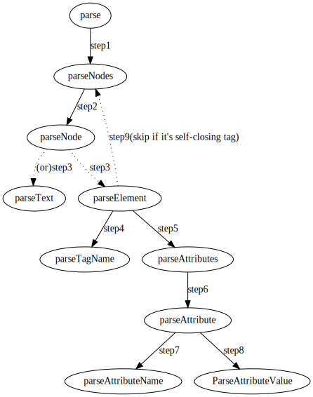

# 不借助第三方函数, 只使用C/C++内置函数实现的豆瓣爬虫

## 前言

看完<<Unix网络编程>>这本砖头书, 感觉不实践下很容易遗忘. 但是日常的工作内容并不会涉及底层网络服务, 一切底层细节内容都被框架给包掉了. 因此决定写个爬虫来实践下, Python下写个爬虫真的是分分钟的事, 只是这样又会让事情变成没意义, 目标是增强网络相关技能, 而不是实现一个爬虫需求. 所以目标就是只用C/C++的内置函数, 不借助任何第三方库实现一个豆瓣爬虫, 以锤炼网络技能和C++技能.

## Html解析

主要的工作就是将html文件解析成DOM树, 然后提供对应的查找方法, 在DOM树上按Id(或者Tag name)查找指定的节点, 查找的方式多种多样, 如xpath, 或者Jquery css selector等. Html解析的工作主要是由`html`和`dom`两个文件负责, `html`负责相应的解析工作, `dom`负责承载解析后相应的数据结构(也就是DOM树). `html`解析的策略是从`html`节点开始, 然后递归查询(此外省略, 到时补充), 相应的方法调用如下图:

## Json解析

## 网络与调度

## 参考

+ [Let's build a browser engine!](https://limpet.net/mbrubeck/2014/08/08/toy-layout-engine-1.html)
